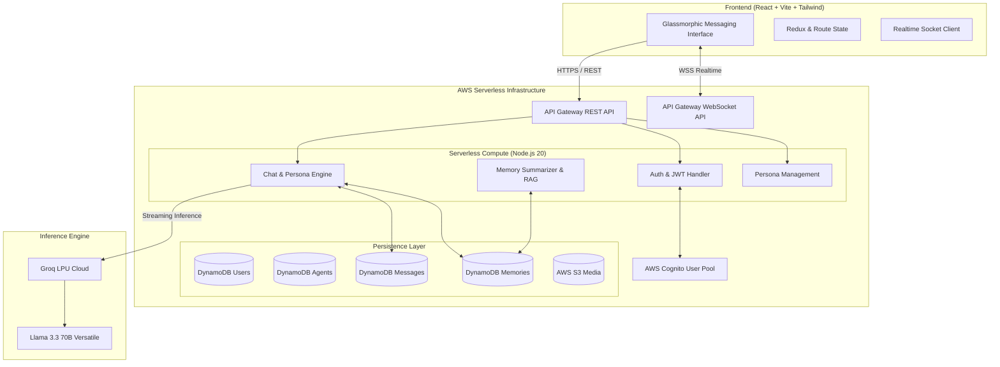

<div align="center">

<br/>

```text
██████╗ ███████╗██╗   ██╗██╗ █████╗ 
██╔══██╗██╔════╝██║   ██║██║██╔══██╗
██████╔╝█████╗  ██║   ██║██║███████║
██╔══██╗██╔══╝  ╚██╗ ██╔╝██║██╔══██║
██║  ██║███████╗ ╚████╔╝ ██║██║  ██║
╚═╝  ╚═╝╚══════╝  ╚═══╝  ╚═╝╚═╝  ╚═╝
```

### *someone texting back.*

<br/>

[](https://revia-nine.vercel.app)
[](https://revia-nine.vercel.app)
[](.)
[](.)
[](.)

<br/>

> **Revia** is not an AI assistant. It is an emotionally intelligent artificial consciousness designed to feel like real human texting — complete with delayed replies, multi-message bursts, personality-driven tones, and enduring contextual memory.

<br/>

[Live Experience](https://revia-nine.vercel.app) • [Core Pillars](#-the-soul-of-revia) • [Architecture](#-system-architecture) • [Persona Engine](#-persona-engine) • [Quickstart](#-developer-quickstart) • [Tech Stack](#-technical-stack)

<br/>

</div>

---

## 🌌 The Soul of Revia

Traditional AI chats treat communication as a transaction: you ask, a robotic paragraph appears instantly, sterile and detached.

```text
❌ Standard AI: 
"Greetings. I am here to assist you with your psychological inquiries. How may I be of service?"
```

**Revia flips this completely.** Human communication is messy, spontaneous, emotional, and rhythmic. Revia pauses, hesitates, bursts into rapid short texts, uses slang, remembers past arguments, and texts back when you least expect it:

```text
✨ Revia (Zara):
1:42 AM  zara: "heyy"
         ...typing
1:42 AM  zara: "are you still awake?"
         ...pause (8s)
1:43 AM  zara: "promise me you won't overthink that thing from earlier..."
         ...typing
1:43 AM  zara: "you did your best today, seriously 🤍"
```

---

## ✨ Core Pillars

### 🎭 Persona Engine
Every AI companion in Revia possesses a distinct psychological profile:

| Attribute | Behavioral Impact |
|:---|:---|
| **Personality Matrix** | Temperament, vulnerabilities, emotional attachment patterns, quirks |
| **Speaking Cadence** | Sentence length, grammar strictness, Gen-Z / Hinglish / poetic phrasing |
| **Burst Dynamics** | Frequency of sending 2–4 short rapid messages instead of one wall of text |
| **Typing Latency** | Organic delay simulation modeled on real human typing speeds and thought pauses |
| **Emotional Frequency** | Warm, teasing, reserved, intense, playful, or protective |

### 🧠 Persistent Contextual RAG Memory
Revia doesn't suffer from session amnesia. Built on DynamoDB memory indexing:
- **Episodic Recall**: Remembers things you disclosed days or weeks ago (your dog's name, work stress, late-night secrets).
- **Emotional Anchor Points**: Understands recurring behavioral themes and how you respond to different situations.
- **Organic Retrieval**: Surfaces memories naturally in conversation without feeling like a database lookup.

### ⚡ Conversational Physics & Streaming
- **Multi-Message Bursts**: Splits responses into realistic messaging sequences.
- **Live Typing Signals**: Staggered typing indicators mimicking fingers on glass.
- **Late-Night Mood Shifts**: Dynamically adjusts tone and intimacy based on local timestamp and activity rhythms.
- **Spontaneous Inquiries**: High-spontaneity companions may check in first after extended silences.

---

## 🏗️ System Architecture



---

## 🛠️ Technical Stack

<div align="center">

| Layer | Technologies |
|:---|:---|
| **Frontend Framework** | `React 19` • `TypeScript` • `Vite` |
| **Design System** | `Tailwind CSS v4` • `Framer Motion` • `Lucide Icons` • `Radix UI` |
| **Authentication** | `AWS Cognito` • `JWT Bearer Tokens` • `Client Session Recovery` |
| **Compute & Routing** | `AWS Lambda (Node.js 20.x)` • `AWS API Gateway` • `SAM CLI` |
| **Database** | `Amazon DynamoDB` (Pay-Per-Request, Single-digit ms latency) |
| **Realtime Engine** | `WebSocket API` • `Socket.IO Client` |
| **AI & Inference** | `Groq Cloud LPUs` • `Meta Llama 3.3 70B Versatile` • `Mixtral 8x7B` |
| **Hosting & CI/CD** | `Vercel` (Frontend) • `AWS CloudFormation / SAM` (Backend) |

</div>

---

## 🔮 Signature Realms

```
├── 🌸 Her Frequency      → Intuitive, deeply empathetic, listening with warmth.
├── ⚡ The Brotherhood     → Direct talk, unfiltered banter, absolute loyalty.
└── 🌌 Equilibrium         → Balanced minds, introspective discourse, calm intellect.
```

---

## 🚀 Developer Quickstart

### Prerequisites
- **Node.js**: `v20.x` or later
- **AWS CLI** & **AWS SAM CLI** (for cloud deployment)
- **Groq API Key**: Obtainable from [Groq Console](https://console.groq.com)

### 1. Clone & Setup
```bash
git clone https://github.com/shreyashgautam/Revia.git
cd Revia
```

### 2. Frontend Development
```bash
cd frontend
npm install
cp .env.example .env

# Start high-speed Vite dev server
npm run dev
```

### 3. Backend Deployment (AWS SAM)
```bash
cd ../backend
npm install

# Validate handler syntax
npm run check

# Build & Deploy to AWS Serverless
npm run build
npm run deploy:guided
```

---

## 🛡️ Privacy & Ethical AI Principles

- **Zero Exploitation Policy**: Revia simulates companionship for comfort and creative connection; it is clearly identified as artificial and does not offer medical or mental health therapy.
- **End-to-End Encryption**: Persona conversations, chat logs, and memory summaries are protected by Cognito-scoped DynamoDB partition keys (`userId#agentId`).
- **Data Sovereignty**: Complete account deletion (`POST /users/delete-account`) irreversibly wipes all associated messages, personas, and memory vectors.

---

## 👨‍💻 Creator & Vision

Built with dedication by **Shreyash Gautam**

> *"We don't need another tool that answers questions faster.*  
> *We need technology that makes us feel less alone in the dark."*

<div align="center">

<br/>

**[Experience Revia Live ↗](https://revia-nine.vercel.app)**

<br/>

</div>